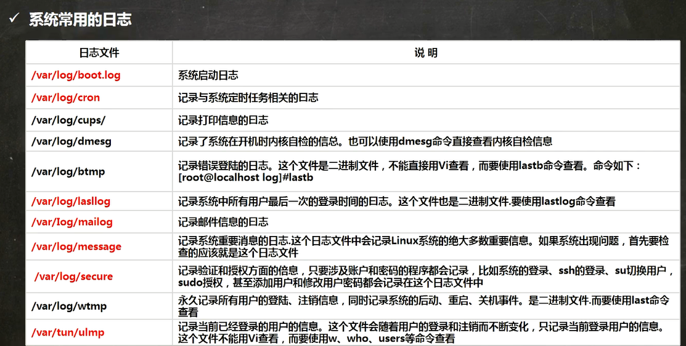

## 日志

### 介绍

日志文件是重要的系统信息文件，其中记录了许多重要的系统时间，包括用户的登录信息、系统的启动信息、系统的安全信息、邮件相关信息、各种服务相关信息等

日志对于安全来说也很重要，它记录了系统每天发生的各种事情，通过日志来检查错误发生的原因，或者受到攻击时攻击者留下的痕迹

日志就是用来记录重大事件的工具

### 系统常用的日志

/var/log/目录就是系统日志文件的保存位置



### 日志管理服务

centos7.6日志服务是rsyslogd，centos6.x日志服务是syslogd。rsyslogd功能更强大

rsyslogd的使用、日志文件的格式和syslogd服务兼容的

查询Linux中的rsyslogd服务是否启动

ps aux | grep " rsyslog" | grep -v "grep"

查询rsysslogd服务的自启动状态

systemctl list-unit-files | grep rsyslog


### 配置文件

/etc/rsyslog.conf

```
编辑文件时的格式为：*.*	存放日志文件
第一个*代表日志类型，第二个*代表日志级别
```


