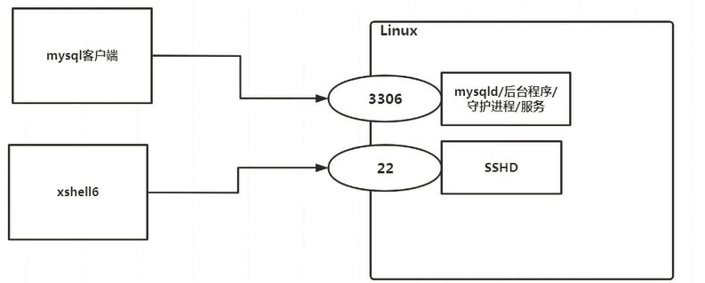

## 服务管理

### 介绍

服务（service）本质就是进程，但是运行在后台，通常都会监听某个端口，等待其他程序的请求，比如（mysql、sshd、防火墙等），因此又称为守护进程

### service管理指令

语法：service 服务名 【strat | stop | restart | reload | status】

### 注意：在centos7.0后很多服务都不在使用service，而是使用systemctl

service指令管理的服务在/etc/init.d查看

### chkconfig指令

语法：

chkconfig --list【| grep xxx】

chkconfig 服务名 --list

chkconfig --level 运行级别 服务名 on/off

描述：可以给服务的各个运行级别设置自启动/关闭

chkconfig管理的服务在/etc/init.d

### systemctl指令

语法：systemctl 【start | stop | restart | status】服务名

systemctl指令管理的服务在/usr/lib/systemd/system查看

systemctl list-unit-files 【 | grep 服务名】（查看服务开机启动状态，grep可以进行过滤）

systemctl enable 服务名（设置服务开机启动）

systemctl disable 服务名（关闭服务开机启动）

systemctl is-enabled 服务名（查询某个服务是否是自启动）

### firewall指令

打开端口：firewall-cmd --permanent --add-port=端口号/协议

关闭端口：firewall-cmd --permanrnt --remove-port=端口号/协议

重新载入：firewall-cmd --reload

查询端口是否开放：firewall-cmd --query-port=端口/协议

### top命令

语法：top 【选项】

选项：

-d 秒数	：指定top命令每隔几秒更新，默认是三秒

-i：使top不显示任何闲置或者僵死进程

-p 进程ID号：通过指定监控进程ID来监控某个进程的状态

#### 操作

p：以cpu使用率排序，默认就是此项

M：以内存的使用率排序

N：以PID排序

q：退出top

监听指定的用户：先按u，再输入用户名称

终止指定的进程：先按k，再输入要结束的进程ID号

### netstat命令

语法：netstat 【选项】

选项：

-an：按一定顺序排序输出

-p：显示哪个进程在调用

描述：监听网络状态